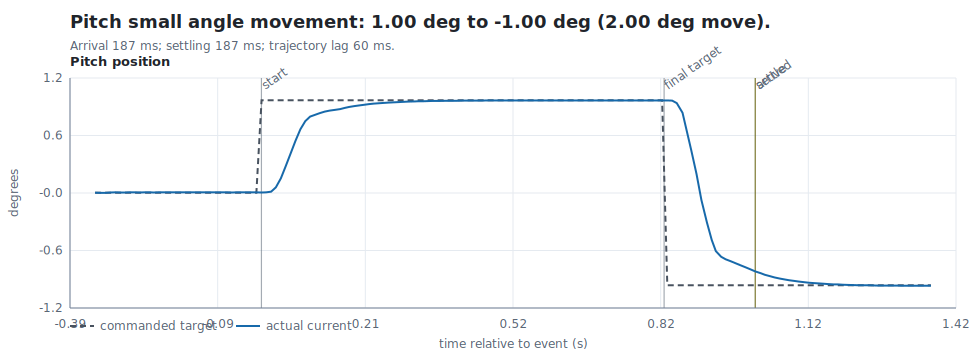
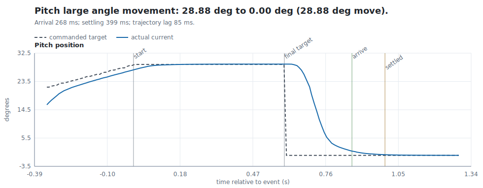
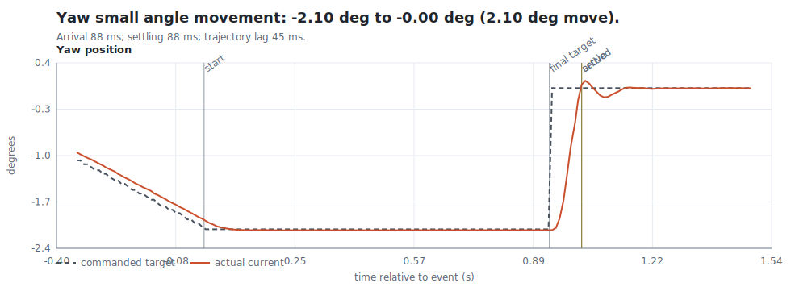
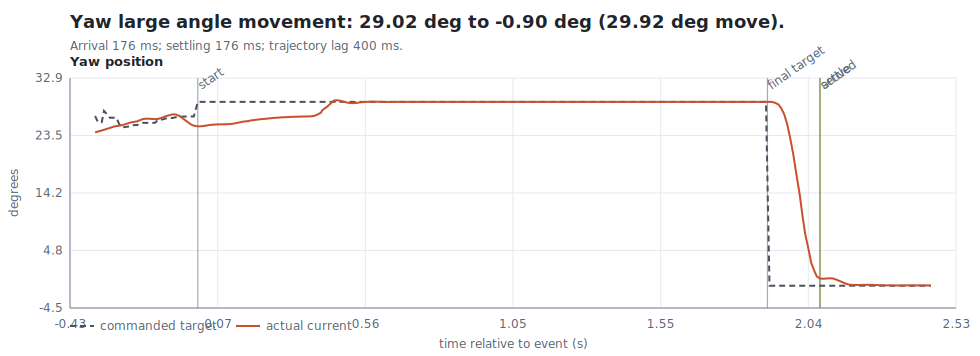
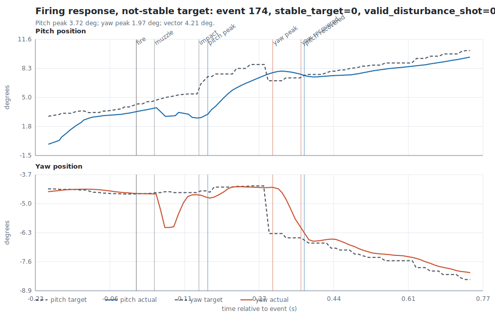
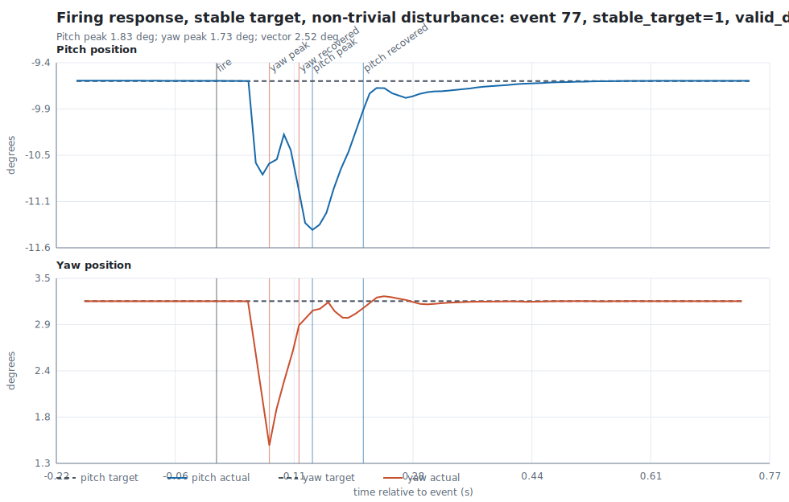

# Motor Control Performance Analysis

This report is generated from `motor.rrd` by `scripts/analyze_motor.py`.

## Method Summary

- Scalar streams are extracted from the Rerun recording and aligned to seconds from the first scalar sample.
- Target updates are grouped into same-direction movement episodes, because the recording contains both step-like commands and streamed ramp/sweep commands.
- `is_step_like_target` marks episodes where the target movement is dominated by one jump rather than many small updates.
- The system-ID step subset keeps step-like targets but excludes final-position arrival below 50 ms, because those near-zero cases were ruled out as invalid for this data.
- `arrival_latency_s` is measured after the last target update in an episode: the first current sample within the final target tolerance.
- `settling_time_s` uses a tighter settling band than arrival and marks the end of the configured hold window: the current position must remain inside that band continuously for the full hold time.
- `trajectory_lag_s` estimates control-loop delay during the commanded movement by delaying the target trajectory and choosing the delay with the lowest RMSE to actual position.
- Fire disturbance is measured as current-minus-target error relative to the pre-fire baseline. Stable-target shots are reported separately because moving targets confound pure mechanical deflection.

## Key Configuration

| parameter | value |
| --- | --- |
| movement_min_step_deg | 0.1000 |
| movement_max_gap_s | 0.7500 |
| movement_min_magnitude_deg | 1.000 |
| step_like_max_target_updates | 1 |
| step_like_min_largest_step_fraction | 0.8000 |
| response_max_s | 2.000 |
| settle_hold_s | 0.0500 |
| tolerance_floor_deg | 0.1500 |
| tolerance_fraction_of_move | 0.0500 |
| settling_tolerance_floor_deg | 0.0300 |
| settling_tolerance_fraction_of_move | 0.0200 |
| lag_max_s | 0.4000 |
| lag_step_s | 0.0050 |
| lag_max_samples | 800 |
| shot_pre_s | 0.1200 |
| shot_post_s | 0.5000 |
| shot_baseline_ignore_s | 0.0200 |
| shot_stable_target_range_deg | 0.5000 |
| shot_recovery_floor_deg | 0.0500 |
| shot_recovery_fraction_of_peak | 0.2000 |
| shot_valid_vector_min_deg | 0.2500 |
| trigger_pair_max_s | 1.000 |
| system_id_min_arrival_latency_s | 0.0500 |

**Table 1.** Analysis thresholds used for this run.

## Dataset Overview

| path | samples | start_s | end_s | duration_s | median_dt_s | min_value | max_value |
| --- | --- | --- | --- | --- | --- | --- | --- |
| /motors/position/pitch/current | 965015 | 0.0000 | 10287.2 | 10287.2 | 0.0101 | -13.99 | 37.05 |
| /motors/position/pitch/target | 56885 | 16.25 | 10108.2 | 10091.9 | 0.0175 | -14.00 | 37.00 |
| /motors/position/yaw/current | 989091 | 0.0007 | 10287.2 | 10287.2 | 0.0100 | -37.00 | 57.16 |
| /motors/position/yaw/target | 56885 | 16.25 | 10108.2 | 10091.9 | 0.0175 | -37.00 | 57.00 |
| /trigger/fire | 375 | 446.82 | 10104.5 | 9657.6 | 7.611 | 1.000 | 1.000 |
| /trigger/impact | 364 | 446.94 | 10104.6 | 9657.6 | 7.371 | 1.000 | 1.000 |
| /trigger/muzzle | 364 | 446.86 | 10104.5 | 9657.6 | 7.368 | 1.000 | 1.000 |

**Table 2.** Extracted scalar streams and basic sampling/value ranges.

## Movement Response

- The response summary below uses the same filtered step-response subset as Figure 2: step-like target movements with final-position arrival at or above the configured minimum latency.
- Pitch median step-response arrival is 227 ms; yaw median step-response arrival is 97 ms.
- Pitch median step-response settling time is 351 ms; yaw median step-response settling time is 270 ms.
- Median overshoot remains near zero for both axes, while p90 overshoot is 0.01 deg for pitch and 0.19 deg for yaw.
- Interpretation: yaw is still faster on clean step arrival, but the filtered table avoids the ramp/sweep and near-zero-arrival artifacts that distorted the previous broad movement summary.
- Step-target filtered arrival plot keeps 693 of 2440 step-like episodes after excluding arrival below 50 ms; 693 appear as points.
- Pitch step-target median final-position arrival is 227 ms across 287 finite-arrival episodes.
- Yaw step-target median final-position arrival is 97 ms across 406 finite-arrival episodes.

| axis | step_size_bin | steps | step_size_median_deg | arrival_median_ms | arrival_p90_ms | settling_n | settling_median_ms | trajectory_lag_n | trajectory_lag_median_ms | max_velocity_median_deg_s | velocity_rise_90_median_ms | overshoot_median_deg | overshoot_p90_deg |
| --- | --- | --- | --- | --- | --- | --- | --- | --- | --- | --- | --- | --- | --- |
| pitch | all | 287 | 6.411 | 226.68 | 247.79 | 259 | 351.38 | 263 | 65.00 | 99.43 | 76.52 | 0.0036 | 0.0124 |
| pitch | 1-2 deg | 64 | 1.000 | 143.42 | 183.83 | 57 | 315.65 | 57 | 65.00 | 14.91 | 53.65 | 0.0040 | 0.0127 |
| pitch | 2-5 deg | 62 | 3.353 | 210.97 | 234.36 | 44 | 342.48 | 53 | 70.00 | 55.52 | 70.01 | 0.0054 | 0.6044 |
| pitch | 5-10 deg | 76 | 8.184 | 228.93 | 237.30 | 75 | 353.30 | 70 | 75.00 | 109.59 | 77.43 | 0.0036 | 0.0054 |
| pitch | 10-15 deg | 62 | 12.00 | 242.82 | 246.65 | 61 | 359.57 | 61 | 0.0000 | 155.04 | 87.86 | 0.0054 | 0.0054 |
| pitch | 15-20 deg | 20 | 19.00 | 252.70 | 259.01 | 20 | 376.40 | 20 | 0.0000 | 215.27 | 101.01 | 0.0018 | 0.0054 |
| pitch | 20-30 deg | 1 | 28.88 | 267.75 | 267.75 | 1 | 398.57 | 1 | 85.00 | 316.46 | 103.88 | 0.0036 | 0.0036 |
| pitch | 30+ deg | 2 | 35.16 | 302.76 | 317.70 | 1 | 404.66 | 1 | 0.0000 | 404.25 | 113.91 | 0.0027 | 0.0049 |
| yaw | all | 406 | 4.573 | 97.00 | 169.57 | 268 | 269.70 | 362 | 35.00 | 100.52 | 61.86 | 0.0822 | 0.1908 |
| yaw | 1-2 deg | 159 | 1.319 | 77.12 | 85.29 | 43 | 254.49 | 134 | 0.0000 | 31.24 | 48.71 | 0.0826 | 0.2415 |
| yaw | 2-5 deg | 49 | 3.209 | 92.29 | 97.62 | 34 | 256.71 | 37 | 45.00 | 67.11 | 52.32 | 0.1422 | 0.2045 |
| yaw | 5-10 deg | 88 | 7.005 | 105.22 | 114.22 | 83 | 264.13 | 85 | 0.0000 | 135.41 | 65.62 | 0.1440 | 0.2039 |
| yaw | 10-15 deg | 10 | 12.90 | 122.57 | 126.93 | 10 | 274.70 | 10 | 45.00 | 215.97 | 78.96 | 0.0252 | 0.0466 |
| yaw | 15-20 deg | 14 | 17.09 | 138.01 | 154.29 | 14 | 291.35 | 13 | 45.00 | 248.72 | 80.90 | 0.0108 | 0.0198 |
| yaw | 20-30 deg | 46 | 26.25 | 159.37 | 168.14 | 44 | 303.09 | 44 | 45.00 | 342.34 | 93.20 | 0.0018 | 0.0027 |
| yaw | 30+ deg | 40 | 32.14 | 179.26 | 207.44 | 40 | 314.46 | 39 | 45.00 | 409.69 | 103.05 | 0.0018 | 0.0036 |

**Table 3.** Step-response summary using the same system-ID subset shown in Figure 2.

_This table uses the Figure 2/system-ID subset, so `steps` is the count of plotted clean step responses in that axis/bin and every row has a finite final-position arrival at or above the configured minimum latency. `settling_n` counts steps where the actual position stayed inside the tighter settling band continuously for the configured 50 ms hold window. `trajectory_lag_n` counts steps with enough samples during the commanded movement to fit a finite target-delay/RMSE estimate. The bins are intentionally broader than the original movement summary because the filtered step-response subset is smaller._

### Movement Exemplars

#### Pitch small angle movement

Pitch small angle movement: 1.00 deg to -1.00 deg (2.00 deg move).

**Figure 1.** Pitch small angle movement: 1.00 deg to -1.00 deg (2.00 deg move).

#### Pitch large angle movement

Pitch large angle movement: 28.88 deg to 0.00 deg (28.88 deg move).

**Figure 2.** Pitch large angle movement: 28.88 deg to 0.00 deg (28.88 deg move).

#### Yaw small angle movement

Yaw small angle movement: -2.10 deg to -0.00 deg (2.10 deg move).

**Figure 3.** Yaw small angle movement: -2.10 deg to -0.00 deg (2.10 deg move).

#### Yaw large angle movement

Yaw large angle movement: 29.02 deg to -0.90 deg (29.92 deg move).

**Figure 4.** Yaw large angle movement: 29.02 deg to -0.90 deg (29.92 deg move).

## Shooting Impact

- Across all fire events, median fire-to-muzzle timing is 41 ms; median fire-to-impact timing is 157 ms.
- In stable-target shots with non-trivial disturbance, median pitch deflection is 1.82 deg at 139 ms; median yaw deflection is 1.71 deg at 72 ms.
- Median recovery is 263 ms for pitch and 175 ms for yaw.
- Interpretation: the clean firing disturbance is present in both axes. Pitch is slightly larger and peaks/recoveries are slower; yaw peaks earlier and recovers faster.
- The stable-target disturbance subset does not have paired muzzle/impact entries within the pairing window, so trigger-chain timing should be taken from the all-events row.

| subset | n | fire_to_muzzle_s_median | fire_to_impact_s_median | pitch_peak_abs_deg_median | pitch_peak_time_s_median | pitch_recovery_s_median | yaw_peak_abs_deg_median | yaw_peak_time_s_median | yaw_recovery_s_median | disturbance_vector_abs_deg_median |
| --- | --- | --- | --- | --- | --- | --- | --- | --- | --- | --- |
| all fire events | 375 | 0.0405 | 0.1566 | 1.948 | 0.1894 | 0.3002 | 1.733 | 0.1742 | 0.2079 | 2.723 |
| stable target shots | 11 |  |  | 1.807 | 0.1386 | 0.2624 | 1.694 | 0.0711 | 0.1726 | 2.478 |
| stable target shots, non-trivial disturbance | 10 |  |  | 1.816 | 0.1390 | 0.2630 | 1.711 | 0.0717 | 0.1746 | 2.498 |

**Table 4.** Fire-event disturbance summary for all shots and stable-target subsets.

### Firing Response Exemplars

#### Not-stable target

Firing response, not-stable target: event 138, stable_target=0, valid_disturbance_shot=0, pitch peak 3.03 deg, yaw peak 1.87 deg.

**Figure 5.** Firing response, not-stable target: event 138, stable_target=0, valid_disturbance_shot=0, pitch peak 3.03 deg, yaw peak 1.87 deg.

#### Stable target, non-trivial disturbance

Firing response, stable target, non-trivial disturbance: event 77, stable_target=1, valid_disturbance_shot=1, pitch peak 1.83 deg, yaw peak 1.73 deg.

**Figure 6.** Firing response, stable target, non-trivial disturbance: event 77, stable_target=1, valid_disturbance_shot=1, pitch peak 1.83 deg, yaw peak 1.73 deg.

## Output Files

- `overview.csv`: extracted stream sizes, rates, and value ranges.
- `movement_metrics.csv`: one row per detected movement episode.
- `movement_summary.csv`: latency and overshoot summaries by axis and movement magnitude.
- `movement_regression.csv`: simple linear/quadratic checks for magnitude-latency relationships.
- `shot_metrics.csv`: one row per fire event, including stability flags.
- `shot_summary.csv`: all-shot and stable-shot disturbance summaries.
- `exemplars.csv`: selected plot examples and the SVG path for each example.
- `plots/*.svg`: exemplary time-series plots for movements and firing responses.
- `motion_disturbance_examples.csv`: moving-target fire examples selected across starting angles.
- `motion_disturbance.html`: time-series plots for disturbance under motion.
- `yaw_10_20_diagnostic_summary.csv`: 2 degree bins for the anomalous yaw 10-20 deg range.
- `yaw_10_20_diagnostics.html`: example time series from each yaw 10-20 deg sub-bin.
- `system_id_step_responses.csv`: preserved step-target subset with velocity metrics.
- `system_id_step_summary.csv`: magnitude-bin summary of the preserved step-target subset.
- `system_id.html`: peak-velocity and velocity-rise diagnostic plots.
- `report.html`: visual companion report.
